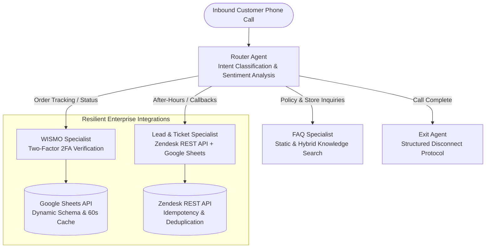

#  Enterprise Multi-Agent Conversational Voice Receptionist

[](https://www.python.org/downloads/)
[](https://google.github.io/agent-development-kit/)
[](https://cloud.google.com/vertex-ai)
[](tests/unit/)
[](LICENSE)

An enterprise conversational AI telephony receptionist built on the **Google Agent Development Kit (ADK)** and powered by **Google Gemini Live** models on Vertex AI. 

Designed for high-throughput, low-latency customer call centers, the service orchestrates specialized subagents to handle order status inquiries, policy FAQs, after-hours lead capture, and CRM ticket dispatch in real time.

---

##  System Architecture & Intent Routing

The system utilizes an intent-routing multi-agent swarm topology to achieve deterministic task execution and prevent context degradation:



---

##  Key Engineering Features

### 1.  Two-Factor Security Verification for Order Lookups (WISMO)
To prevent unauthorized disclosure of customer PII (Personally Identifiable Information) over voice telephony, the Order Specialist implements a strict two-factor verification barrier:
- **Factor 1**: Telephony Caller ID / Verified Phone Number.
- **Factor 2**: Invoice Number or Purchase Order Reference (PO).
- Order status and carrier tracking links are only revealed when both factors match the verified database record.

### 2.  Latency-Optimized Voice Persona (<40-Word Mandate)
- Real-time voice agents require ultra-fast Time-To-First-Token (TTFT). Prompts enforce a strict **<40-word per turn budget** to deliver crisp, natural conversational cadence without overwhelming the caller.

### 3.  Resilient CRM Integration & Request Idempotency
- **Zendesk API**: Suffixes unique MD5 idempotency keys on ticket creation payloads to eliminate duplicate support tickets during transient network retries.
- **Google Sheets Client**: Implements runtime header index resolution to prevent hardcoded column drift when spreadsheets are edited by non-technical operators. Features a 60-second in-memory TTL cache to minimize API quota consumption.

---

##  Repository Structure

```text
enterprise-voice-receptionist/
├── app/
│   ├── agent.py               # Main ADK Multi-Agent Orchestrator
│   ├── agent_runtime_app.py   # Cloud Run / Agent Runtime server entrypoint
│   ├── tools.py               # Tool declarations (@tool)
│   ├── agents/                # Conversational playbooks & system prompts
│   │   ├── router.txt
│   │   ├── wismo_receptionist.txt
│   │   ├── receptionist.txt
│   │   ├── faq_receptionist.txt
│   │   ├── exit_agent.txt
│   │   └── faq_data.json
│   ├── tools_lib/             # Resilient Integration Adapters
│   │   ├── sheets.py          # Dynamic header parsing & 60s caching client
│   │   └── zendesk.py         # Idempotent Zendesk REST API client
│   └── app_utils/             # OpenTelemetry & type utilities
│       ├── telemetry.py
│       └── typing.py
├── tests/
│   ├── unit/                  # 100% Mocked Offline Unit Tests
│   │   ├── test_environment_sanity.py
│   │   ├── test_wismo_verification.py
│   │   └── test_zendesk.py
│   └── integration/           # Live Vertex AI streaming tests
│       ├── test_agent.py
│       └── test_agent_runtime_app.py
├── pyproject.toml             # Standard Python dependency specification
└── README.md
```

---

##  Quick Start & Test Execution

### 1. Clone & Install Dependencies
```bash
git clone https://github.com/dnguyen029/receptionist-template.git
cd receptionist-template

# Create and activate virtual environment
python3 -m venv .venv
source .venv/bin/activate

# Install dependencies
pip install -e .
```

### 2. Run Offline Unit Tests (Zero Credentials Required)
All unit tests are fully mocked and execute deterministically without cloud credentials:

```bash
pytest tests/unit/ -v
```
============================= test session starts ==============================
tests/unit/test_environment_sanity.py .                                  [  7%]
tests/unit/test_wismo_verification.py ..........                         [ 84%]
tests/unit/test_zendesk.py ..                                            [100%]
============================== 13 passed in 1.45s ==============================

---

##  Cloud Run / Vertex AI Deployment

```bash
# Set GCP Project
gcloud config set project <YOUR_GCP_PROJECT_ID>

# Deploy container to Cloud Run / Agent Runtime
gcloud run deploy enterprise-voice-receptionist \
  --source=. \
  --region=us-central1 \
  --set-env-vars="PROJECT_ID=<YOUR_GCP_PROJECT_ID>,GOOGLE_CLOUD_LOCATION=us-central1,GOOGLE_GENAI_USE_VERTEXAI=True"
```

---

##  License
This project is licensed under the MIT License — see the [LICENSE](LICENSE) file for details.
